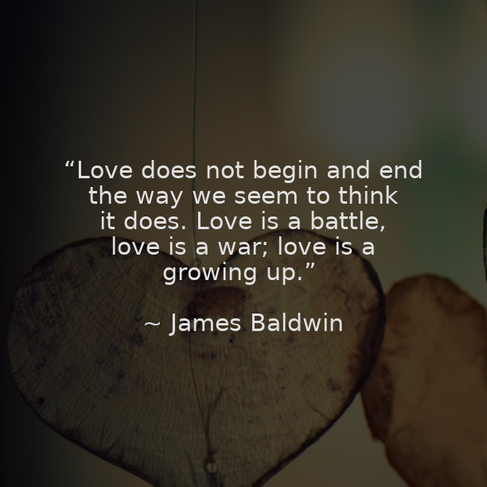

# Insta-Quotes-Generator
This is a simple script used to scrape a random quote from internet and Create An Instagram Format Post For The Same.
Fetches a relevant background for the post and generates a custom caption. 
Currently, all uploads are done to the account: https://www.instagram.com/botquotes.py/

Uses Python PIL Library.  

Upcoming Changes: 
<b>1.</b><strike> Add Support To Add Post Directly To Instagram.</strike> 
<b>2.</b> Use tags as hastags for the post. 
<b>3.</b> Better Customizability Options. 
<b>4.</b> <strike> Better way to use fonts.</strike>
<b>5.</b> Dynamic text resizing for longer quotes.

<b>Sample Images:</b> 

